# Magic Square Game

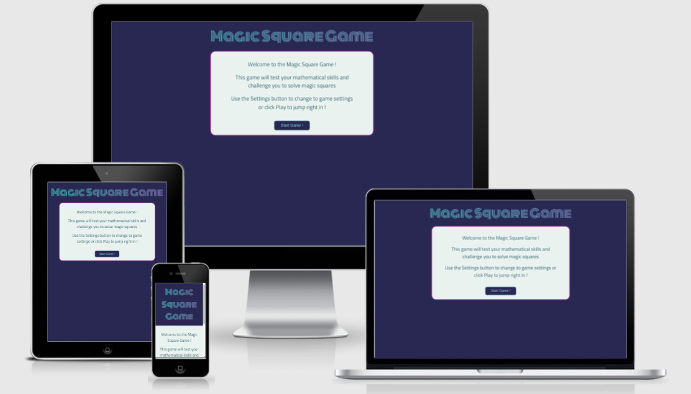

- [Magic Square Game](#magic-square-game)
  * [Objective](#objective)
    + [User stories](#user-stories)
  * [Wireframes](#wireframes)
  * [JavaScript](#javascript)
    + [Magic Square Generation](#magic-square-generation)
    + [Site Interaction](#site-interaction)
  * [Layout and Features](#layout-and-features)
    + [Fonts](#fonts)
    + [Color Scheme](#color-scheme)
    + [Layout and Features](#layout-and-features-1)
    + [Potential Additional Features](#potential-additional-features)
  * [Testing](#testing)
    + [Device Testing](#device-testing)
    + [Performance Testing](#performance-testing)
    + [Validator Testing](#validator-testing)
    + [Bugs](#bugs)
    + [Unfixed Bugs](#unfixed-bugs)
    + [Other Testing Notes](#other-testing-notes)
  * [Deployment](#deployment)
  * [Attribution](#attribution)
  * [Development](#development)
    + [Languages](#languages)
    + [Tools / Technologies](#tools---technologies)
    + [Other](#other)

## Objective

The objective of the site is to create a game that will present [magic squares](https://en.wikipedia.org/wiki/Magic_square) for the user to solve. 

In developing the site, I decided to dynamically generate the magic squares; this introduced some complexity in the structure of the JavaScript code but overall led to a more robust game with an extremely large number (**773,584,182**) of possible permutations for the number of magic squares to solve.

### User stories

As a site user:

- I want a site that is easy to use and navigate
- I want a site that provides visual cues and feedback depending on my actions
- I want a site that offers varying difficulty levels and provides guidance if stuck
- I want a site that works across different devices and platforms

As a site owner:

- I want to ensure that the site has a distinctive visual identity
- I want to develop a site with a clear call to action
- I want to ensure that the Magic Square game is easy to play and provides assistance to the user if they are stuck
- I want to ensure that the user base is as wide as possible and that the site works across different platforms and screen sizes
- I want the ability to dynamically generate the magic squares as opposed to using a library of magic squares to serve to the user to solve

- - - 

## Wireframes

Before building the site, I mapped out the following wireframes using [wireframe.cc](https://wireframe.cc/). My objective was to target a simple design and to ensure that the intention of each page was clear to the user.

  - 

    
<strong style="color:skyblue">Intro Page Wireframe:</strong>

    <a href="https://wireframe.cc/cWFJp3" target="_blank">Wireframe from wireframe.cc</a>
    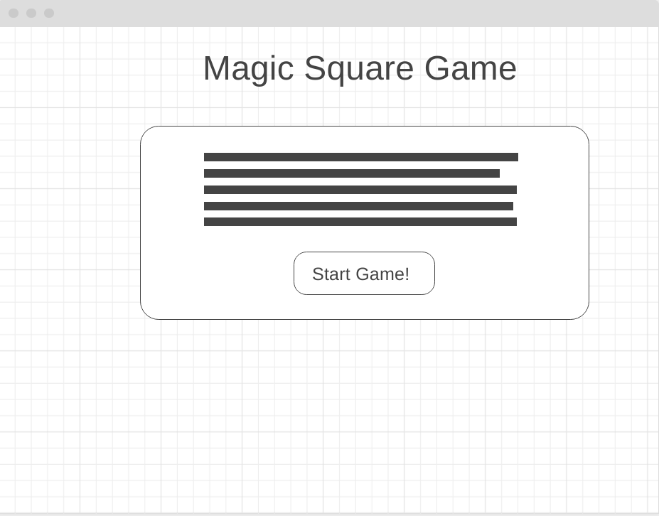
    

  - 

    
<strong style="color:skyblue">Instructions Page Wireframe:</strong>

    <a href="https://wireframe.cc/C2WVwq" target="_blank">Wireframe from wireframe.cc</a>
    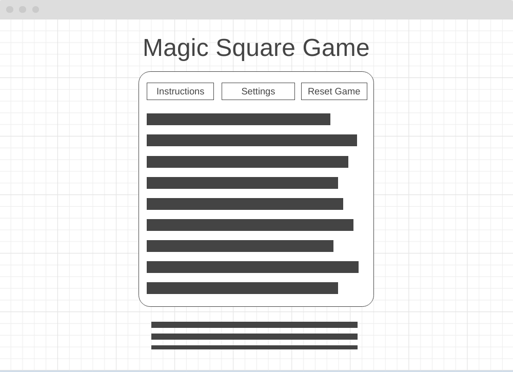
    

  - 

    
<strong style="color:skyblue">Settings Page Wireframe:</strong>

    <a href="https://wireframe.cc/oG2XvV" target="_blank">Wireframe from wireframe.cc</a>
    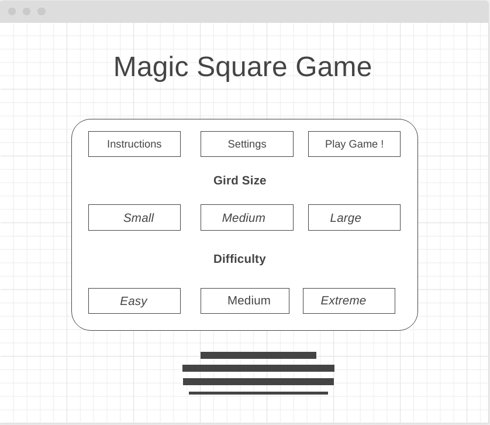
    

  - 

    
<strong style="color:skyblue">Game Page Wireframe:</strong>

    <a href="https://wireframe.cc/FEA7MX" target="_blank">Wireframe from wireframe.cc</a>
    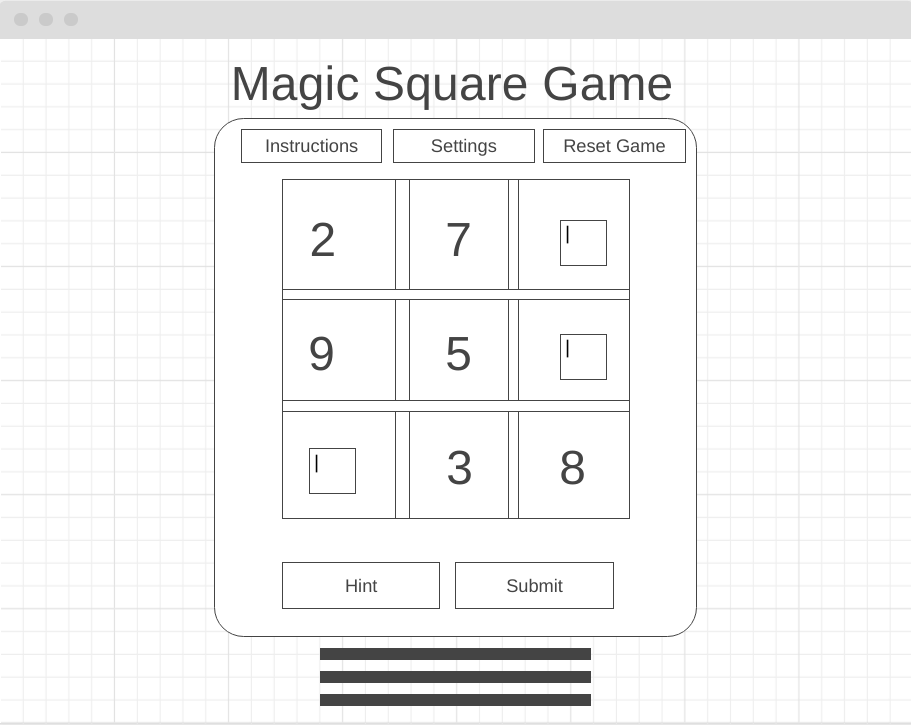
    

  - 

    
<strong style="color:skyblue">Responsive Layout Wireframe:</strong>

    <a href="https://wireframe.cc/HNiknf" target="_blank">Wireframe from wireframe.cc</a> 
    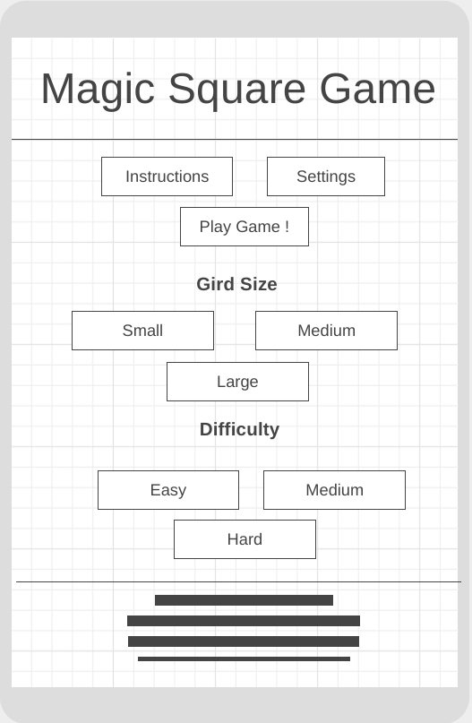
    

On implementing the actual design, I made one minor change - the three control buttons *(Instructions, Settings, Play Game)* were moved out of the game container box. Instead I decided to place these three buttons under the site title.

I felt that this led to an improved user experience, with a clear separation between the game and the controls used to move between the different game sections.

- - - 

## JavaScript

JavaScript was used to achieve the following functionality:

- To dynamically create the values for the Magic Square that the user will solve
- To control user responses to button presses and to validate user inputs

### Dynamically Generating the Magic Square

An array of length `n` can be transformed into a magic square with row and column of size `root n` if the difference between each consecutive element in the array is a fixed constant `k`. (for example, with `n=9` and `k=0` the sequence `[1,2,3,4,5,6,7,8,9]` forms a solvable magic square of size `3x3`)

In order to algorithmically generate a magic square, the following inputs are required:

- A sequence of `n` integers, with a fixed difference `k` between subsequent integers 
- An algorithm for mapping the values such that they form a magic square. The [De la Loubère](https://en.wikipedia.org/wiki/Siamese_method) (or siamese) method is proposed as the algorithm for completing the magic square.  

In order to generate the magic square, the following functions were defined:

- **`SetSquareDiff()`**: This function generates a random value for the difference `k`; the range for the value `k` is defined by the difficulty level that the user selects. There are 3 potential values for `k` for each difficulty level with the default difficulty level being *easy*. For instance the values of `k` for easy can fall in the range of `[0,2]`; the exact value is chosen randomly for the selected difficulty level.
- **`genSquare())`**: This function generates an array of length `n` with each consecutive value in the array increasing by a fixed constant `k`. The value `n` is defined by the square size selected by the user; the default grid size is `3x3` yielding a value of `n` equal to 9
- **`makeSquare()`**: For an inputted array, this function applies the De la Loubère method to arrange the values into a Magic Square. The function creates a matrix of size `root n` by `root n` before returning a flattened array of length `n`
- **`fillSquare()`** This function takes an integer value representing the size of the square and performs the following:
    - Modifies the HTML code to create the gird for the magic square
    - Populates the square values in the HTML code using the array ordered by the `makeSquare()` function
    - Randomly removes `root n` values from the completed magic square and replaces them with an input box for completion by the player of the game (e.g. for a square of size 7x7, 7 values are randomly removed for completion by the user)

The fixed constant `k` is randomly generated with 3 possible values for each difficulty level. In addition the values that are removed for completion by the user are also randomly selected. This lends to a large number of potential game combinations as follows:

- **Small Grid size**: 3 difficulty levels by 3 potential values for `k` by 84 combinations for the removed values = 756 possible game combinations
- **Medium Grid size**: 3 difficulty levels by 3 potential values for `k` by 53,130 combinations for the removed values = 478,170 game combinations
- **Large Grid size**: 3 difficulty levels by 3 potential values for `k` by 85,900,584 combinations for the removed values = 773,584,182 game combinations

### Site Interaction

In order to interact with the site JavaScript and jQuery are used to provide the following functionality:

- Store the size and difficulty levels as selected by the user
- To change the color of the setting buttons once the user makes a selection
- To modify the HTML code to create the magic square
- To hide sections of the website depending on the user selection 

- - - 

## Layout and Features

### Fonts

In selecting the fonts for the site I had two objectives:

- Select a title font that could be used in place of a logo
- Select a font that would compliment the title font while retaining legibility

The site fonts were chosen using [Google Fonts](https://fonts.google.com/). The fonts chosen were [Monoton](https://fonts.google.com/specimen/Monoton?query=monoton) for the title and [Titillium Web](https://fonts.google.com/specimen/Titillium+Web?query=titill) for the body content.

### Color Scheme

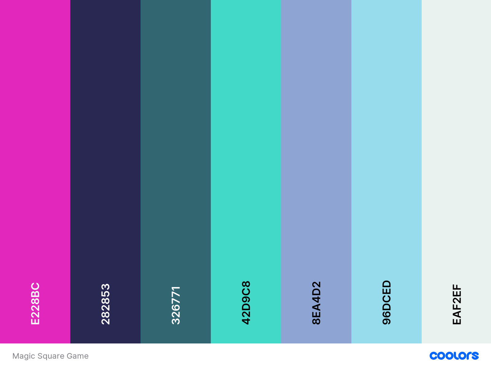

A broad color palette was chosen for the site with a range of complimenting colors chosen.

In choosing the color palette, my objective was to select a color palette that would create a strong visual identity as well as suggest a playful, fun game.

### Features
The following section provides an overview of the site features and design, with screenshots providing a visual overview of each feature.

- **Introduction Container**

  - 

    
<strong style="color:skyblue">Screenshot:</strong>

    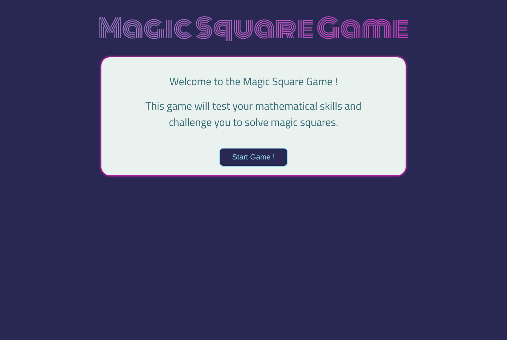
    

  - The Introduction pane welcomes the user to the site and features a clear call to action.
  - I originally planned a site logo, however ultimately I used a text logo; this logo animates when the user hovers over it and this feature helps to create a clear sense of identity for the site

- **Instructions Container**
  
  - 

    
<strong style="color:skyblue">Screenshot:</strong>

    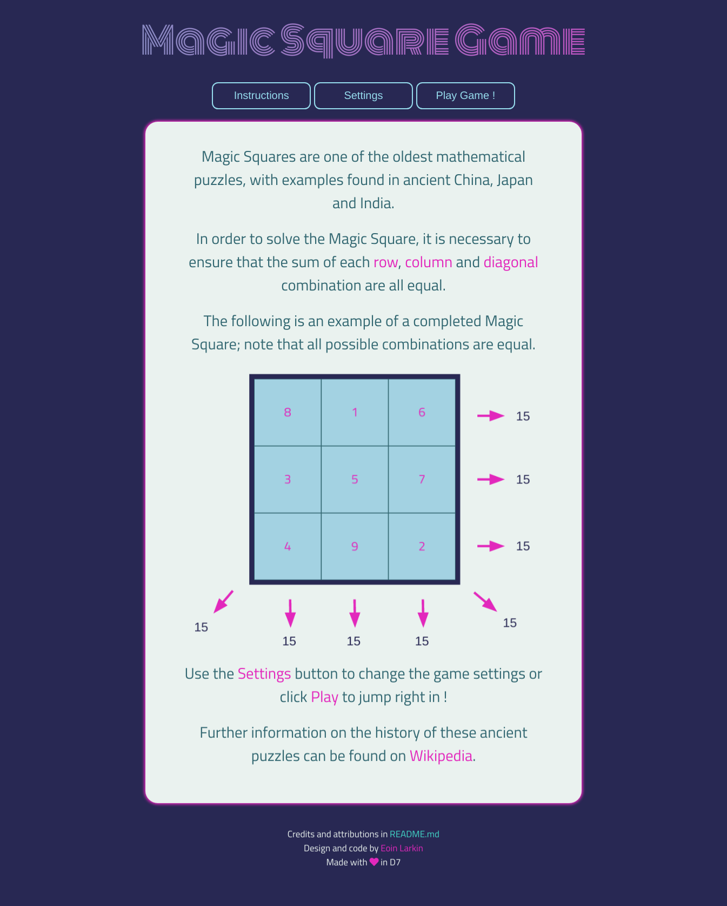
    

  - The Instructions pane provides the following detail:
      - Historical information on Magic Squares
      - Instructions on how to solve the Magic Square
      - A image providing a graphical visualisation of how to solve the game

- **Settings Container**

  - 

    
<strong style="color:skyblue">Screenshot:</strong>

    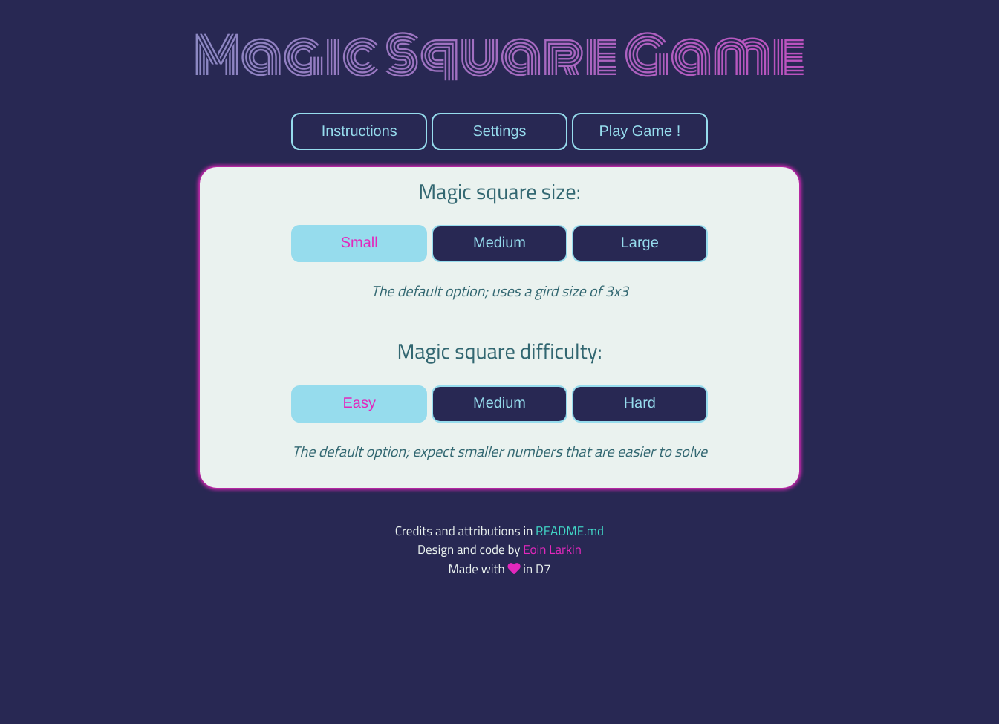
    

  - The Setting pane has the following features:
      - Each button has a shadow on hover by the user
      - The size and difficulty buttons change color on selection
      - Text underneath the button provides context on the difficulty and size settings

- **Game Container**

  - 

    
<strong style="color:skyblue">Screenshot 01:</strong>

    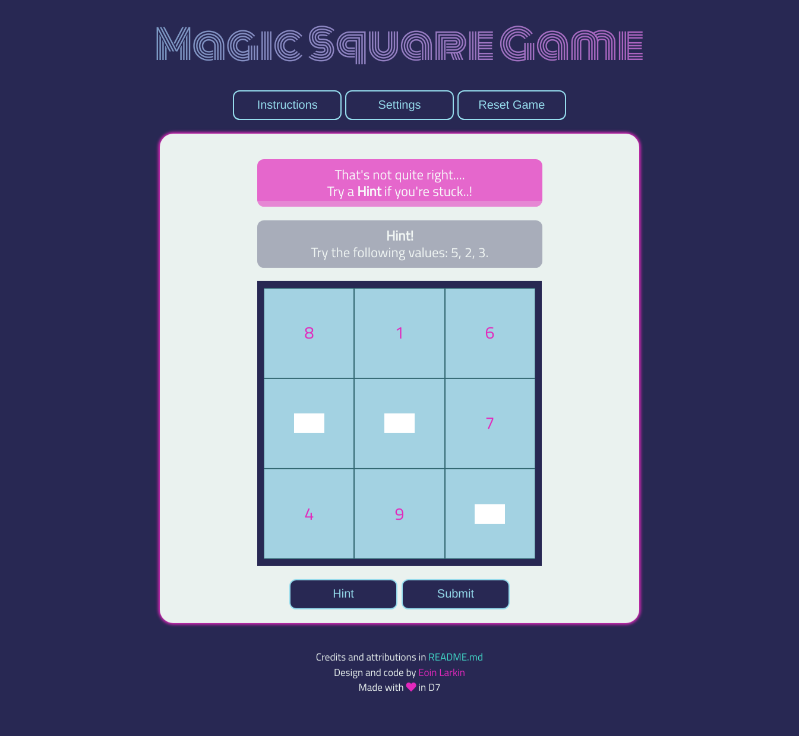
    

  - 

    
<strong style="color:skyblue">Screenshot 02:</strong>

    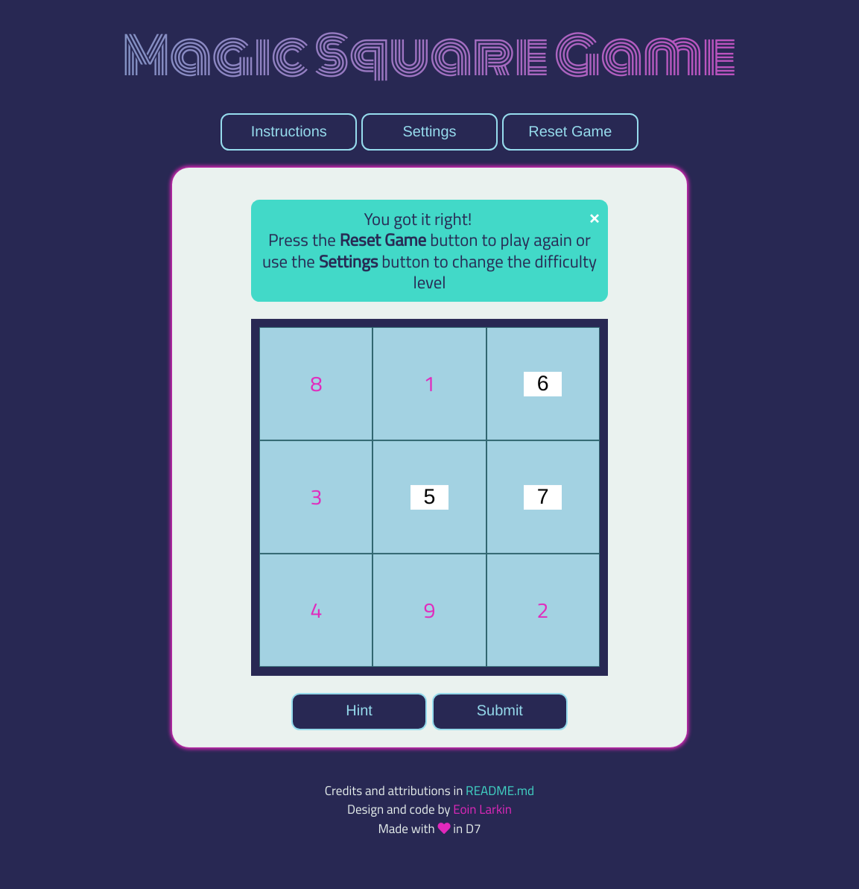
    

  - The Game screen displays the Magic Square with the missing values for input by the user
  - The Hint button is used to generate Hints for the user; there are four possible levels of Hint which are triggered by the number of times the user clicks on the Hint button
  - On clicking the Submit button, there are two possible responses:
      - The Success alert displays if the user correctly completes the magic square
      - The Incorrect alert displays if the user incorrectly completes the magic square

- **Responsive Design**

  - 

    
<strong style="color:skyblue">Screenshot:</strong>

    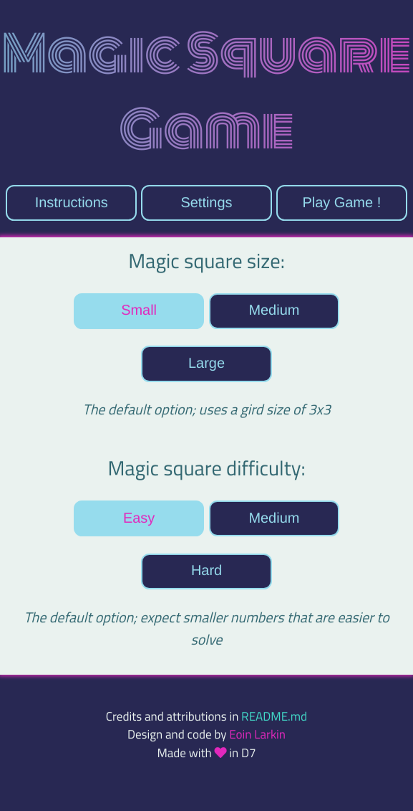
    

  - The site has been designed to be fully responsive for screen sizes from `280px` upwards. For screen sizes less than `525px` in width, the container collapses and spans the width of the screen

### Potential Additional Features

Overall, I am satisfied with the functionality and feature set of the developed site. In terms of additional features, I believe the game could be further enhanced through the addition of a scoreboard feature.

- **Scoreboard**
This would provide users with the ability to view their scores; I would propose implementing a timer, with the user assigned a scored based on how quickly they managed to solve the Magic Square. The feature would require the use of local storage to record the user name and score and allow multiple users to play against each other.

- - - 

## Testing 

### Device Testing

Testing was completed across a number of platforms as follows:

- The site was tested on Chrome, Firefox and Safari
- Platform specific testing was completed on Windows and Linux desktop environments. Mobile testing was completed on iOS
- The site responsiveness was tested across both Apple phones and tables. In addition, responsiveness was tested using Chrome Dev Tools, wth screen sizes from `280px` (Galaxy Fold) upwards tested.

### Performance Testing

Performance was tested using Lighthouse in Chrome Dev Tools. No significant issues were reported for either Desktop of Mobile

- **Desktop Results**  
  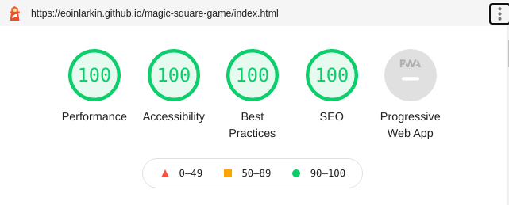  
  The full report can be found [here](docs/lighthouse/lighthouse-desktop.pdf)

- **Mobile Results**  
  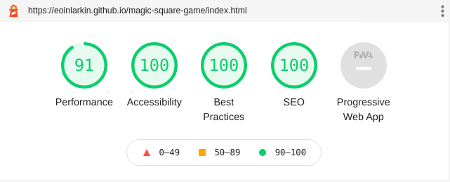  
  The full report can be found [here](docs/lighthouse/lighthouse-mobile.pdf)

### Validator Testing 

- HTML
    - No errors were reported when running the code through the official [W3C validator](https://validator.w3.org/nu/?doc=https%3A%2F%2Feoinlarkin.github.io%2Fmagic-square-game%2F) 
- CSS
    - No errors were found when passing through the official [Jigsaw validator](https://jigsaw.w3.org/css-validator/validator?uri=https%3A%2F%2Feoinlarkin.github.io%2Fmagic-square-game%2F&profile=css3svg&usermedium=all&warning=1&vextwarning=&lang=en)
    - A number of warnings were triggered; however these related to the use of vendor extensions to enable the animation of the main title (e.g. `-moz-text-fill-color`)
- JavaScript
    - No errors were found when passing through the official [Jshint validator](https://jshint.com/).
    - The following screenshot summarises the output:  
    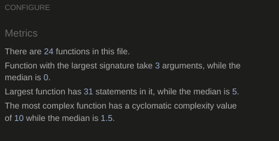
      
### Bugs

The following bugs were encountered during the development and the following fixes were implemented:

- - - 
**Bug**: As part of the hint alert box, the maximum and minimum missing values are displayed to the user. Initially, instead of displaying the min and max values, a NaN value was returned for the minimum and maximum values. 

**Fix**: This bug was resolved by implementing the fix proposed by the following [link](https://medium.com/@vladbezden/how-to-get-min-or-max-of-an-array-in-javascript-1c264ec6e1aa).  It is not possible to apply the `min` and `max` functions directly to a `list` in JavaScript; rather the list must first be destructed.

- - - 
**Bug**: If the user selected a Hint and then restarted the game or changed the settings, it was not possible to generate a new Hint; this was despite the fact that the `hide` styling had been removed from the Hint alert.

**Fix**: On reviewing the code, it was determined that it was necessary to also remove the `style` attribute of the Hint alert in addition to removing the `hide` styling. A similar fix was required for the Wrong answer alert.

- - - 
**Bug**: On testing the website on Firefox, it was noted that the Main Title had an underline on hover; this underline did not appear on Google Chrome which was the primary browser on which the site was developed.

**Fix**: This was resolved by adding an explicit `text-decoration` styling of `none` to the Title on hover.

- - - 

### Unfixed Bugs

There are no known bugs present in the final site deployment.

- - - 

### Other Testing Notes

- To support site testing, the completed Magic Square is logged to the DOM for each generated Magic Square. This was designed to support testing of the site; I would propose removing this logging in the final version of the deployed site.

- - - 

## Deployment

The site was deployed using GitHub pages to the following location: [link](https://eoinlarkin.github.io/magic-square-game/)

- - - 

## Attribution 

- The following guide was used to create the text gradients [link](https://fossheim.io/writing/posts/css-text-gradient/)
- The following StackOverFlow post was used to help implement the `fadeIn` and `fadeOut` functionality of the `container-intro` div: [link](https://stackoverflow.com/questions/12584481/simple-fade-in-fade-out-div-with-jquery-on-click)
- Sample code was leveraged from the following CodePen example to create the animated gradient for the title [link](https://codepen.io/bsander/pen/pPpbNm?editors=1100)
- The following function was used to generate the random values for the value `k` which represents the increment in the magic square array values: [link](https://developer.mozilla.org/en-US/docs/Web/JavaScript/Reference/Global_Objects/Math/random#getting_a_random_integer_between_two_values)
- The following paper was used to better understand the algorithm to generate the Magic Square: [link](https://www.mathworks.com/content/dam/mathworks/mathworks-dot-com/moler/exm/chapters/magic.pdf)
- The following code examples were used to help create the alert banners that were used for the *hint*, *correct answer* and *wrong answer* messages: [link](https://www.w3schools.com/howto/howto_js_alert.asp)
- The Wikipedia page on the siamese method for providing the gif used to illustrate the method: [link](https://en.wikipedia.org/wiki/Siamese_method#/media/File:SiameseMethod.gif)  

- - - 

## Development

### Languages
- HTML
- CSS
- JavaScript
- jQuery

### Tools / Technologies

- **[VScode](https://code.visualstudio.com/)**  
All coding was completed in VS Code.
- **[wireframe.cc](https://wireframe.cc/)**  
This site was used to build the wireframes for the site layout.
- **[cdnjs](https://cdnjs.com/libraries/jquery)**  
cdnjs was used as the reference for the jQuery JavaScript library.
- **[coolors.co](https://coolors.co/)**  
Potential site palettes were tested with Coolors.  
- **[gauger.io](https://gauger.io/fonticon/)**  
This website was used to generate the favicon using an icon from Font Awesome.
- **[Am I Responsive?](http://ami.responsivedesign.is/)**  
For rendering the device preview image
- **[https://ecotrust-canada.github.io/](https://ecotrust-canada.github.io/markdown-toc/)**  
For generating the formatted table of contents in markdown
- **[Google Fonts](https://fonts.google.com/)**  
Used to provide the custom fonts for the site

### Other

- CodeInstitute modules on HTML, CSS and JavaScript.
- My mentor for his suggestions and feedback on the project.
- My friends who helped test the logic and design of the website.
- My teachers who first introduced me to Magic Squares and the symmetries that exist in mathematics.

- - - 